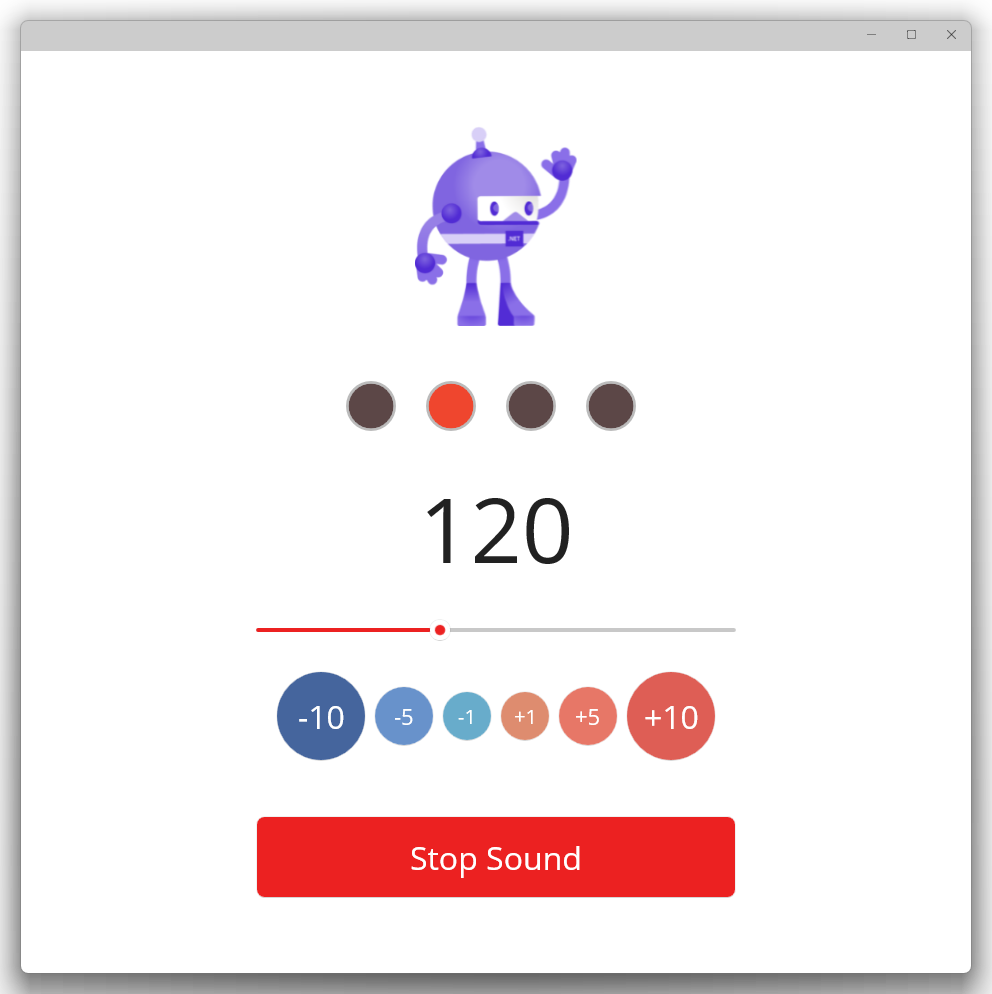

# Metronome App

**[.NET MAUI](https://learn.microsoft.com/ja-jp/dotnet/maui/what-is-maui)** を用いて制作したメトロノームアプリです。  
（Windows でのみ動作確認。Mac, Android, iOS での動作確認はしていません）

    

## ここが便利！

* オーディオデバイスが切り替わったあとでも、「停止」→「再生」をおこなうことで音声再生を復活できる！（このアプリを作ったきっかけ。既存のWindowsストアアプリだとそれが出来なかった）
* テンポを +10, -10 で切り替えられるので楽器の練習に最適！（このアプリを作ったきっかけ２。Windowsストアアプリでその機能を持っているものがなぜかほぼなかった……）

## ここが足りない！

自分の欲しい機能は満たしたので追加の制作予定はありませんが、メモとして。

* ボリューム設定
* 設定したボリュームを覚えておく機能
* よく使うテンポをすぐ選べるようにする機能
* ８分音符、16分音符、３連符などに対応
* オーディオデバイスの切り替わりを検知し、停止ボタンを押さずとも自動で MediaPlayer を作り直す
* ミリセカンドよりも細かい精度
* PCが重いときでも精度が下がらないように

## インストール方法

デバッグでもインストールされますが、きちんとやるには以下の方法を用います。

https://learn.microsoft.com/ja-jp/dotnet/maui/windows/deployment/publish-cli
