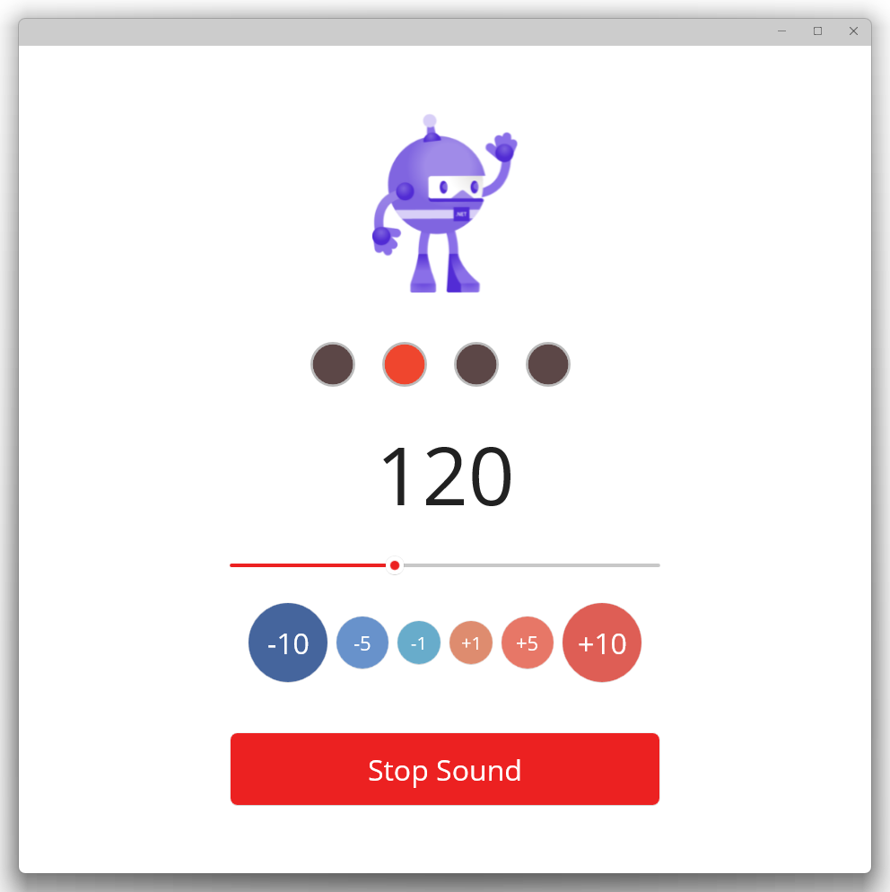

# Metronome App

**[.NET MAUI](https://learn.microsoft.com/ja-jp/dotnet/maui/what-is-maui)** を用いて制作したメトロノームアプリです。  
（Windows でのみ動作確認。Mac, Android, iOS での動作確認はしていません）

## ビルド方法（Windows）

.NET 9 SDK、.NET MAUI ワークロード、Windows SDK をインストールしてください。Windows では Windows ターゲットだけを標準でビルドします。

```powershell
dotnet restore MetronomeApp.sln
dotnet build MetronomeApp.sln
```

MSIX の作成とインストールは、この README の後半に手順があります。リポジトリに残っている古いテスト証明書は使用しません。

<p align="center">
    
</p>


## ここが便利！

* オーディオデバイスが切り替わったあとでも、「停止」→「再生」をおこなうことで音声再生を復活できる！（このアプリを作ったきっかけ。既存のWindowsストアアプリだとそれが出来なかった）
* テンポを +10, -10 で切り替えられるので楽器の練習に最適！（このアプリを作ったきっかけ２。Windowsストアアプリでその機能を持っているものがなぜかほぼなかった……）


## ここが足りない！

自分の欲しい機能は満たしたので追加の制作予定はありませんが、メモとして。

* ボリューム設定
* 設定したボリュームを覚えておく機能
* よく使うテンポをすぐ選べるようにする機能
* ８分音符、16分音符、３連符などに対応
* オーディオデバイスの切り替わりを検知し、停止ボタンを押さずとも自動で MediaPlayer を作り直す
* ミリセカンドよりも細かい精度
* PCが重いときでも精度が下がらないように


## 署名付き MSIX を作る（Windows）

以下は自己署名証明書を使うテスト用の手順です。PowerShell でこのリポジトリのフォルダーに移動してから実行します。

初回だけ、`Platforms/Windows/Package.appxmanifest` の Publisher と同じ `CN=nekonenene` の証明書を作ります。

```powershell
New-SelfSignedCertificate -Type Custom -Subject 'CN=nekonenene' `
    -KeyUsage DigitalSignature -CertStoreLocation 'Cert:\CurrentUser\My' `
    -TextExtension @('2.5.29.37={text}1.3.6.1.5.5.7.3.3', '2.5.29.19={text}') `
    -FriendlyName 'MetronomeApp MSIX test signing' -NotAfter (Get-Date).AddYears(2)
```

次に、証明書を選んで MSIX を作ります。

```powershell
$cert = Get-ChildItem Cert:\CurrentUser\My |
    Where-Object { $_.Subject -eq 'CN=nekonenene' -and $_.NotAfter -gt (Get-Date) -and $_.HasPrivateKey } |
    Sort-Object NotAfter -Descending |
    Select-Object -First 1
if (-not $cert) { throw '有効な CN=nekonenene の署名証明書がありません。' }

dotnet publish .\MetronomeApp.csproj -f net9.0-windows10.0.19041.0 -c Release `
    -p:RuntimeIdentifierOverride=win10-x64 `
    -p:WindowsPackageType=MSIX `
    -p:AppxPackageSigningEnabled=true `
    -p:PackageCertificateThumbprint=$($cert.Thumbprint)
```

`bin/Release/net9.0-windows10.0.19041.0/win10-x64/AppPackages/` 以下に、`.msix` と公開鍵の `.cer` が生成されます。

## MSIX をインストールする

インストールする PC に、生成された **`.msix` と `.cer` の両方**をコピーします。リポジトリ内の古い `.pfx` は不要です。作成した PC 自身にインストールする場合も、次の証明書登録が必要です。

1. `.cer` をダブルクリックし、**［証明書のインストール］**を選びます。
2. 保存場所に **［ローカル コンピューター］**を選びます。管理者権限の確認が出たら許可します。
3. **［証明書をすべて次のストアに配置する］**を選び、［参照］から **［信頼されたユーザー（Trusted People）］**を指定します。
4. ［次へ］→［完了］を押します。
5. `.msix` をダブルクリックし、［インストール］を押します。

「現在のユーザー」ではなく「ローカル コンピューター」に登録してください。「信頼されたルート証明機関」は選びません。自己署名証明書で作った MSIX は、その証明書を信頼した PC でのみインストールできます。詳しくは [Microsoft の MSIX トラブルシューティング](https://learn.microsoft.com/ja-jp/windows/msix/msix-troubleshooting-guide)を参照してください。
